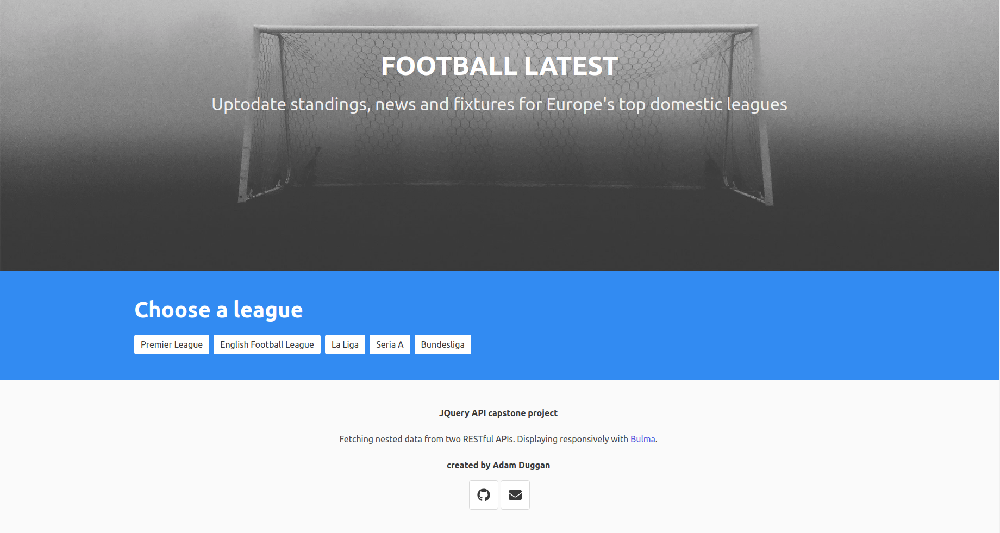
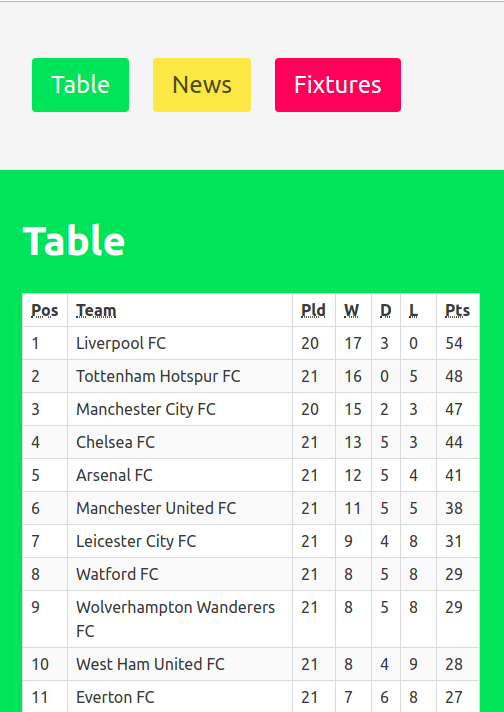

FOOTBALL LATEST

Summary:
This Web App displays the latest news stories, current league standings and upcoming fixtures for five of Europe's top football competitions.  The user is directed to selected a league. Their selection fires GET request's to two separate APIs (api.football.data.org and newsapi.org).

Technologies used:
I used Postman to dissect the returned AJAX data. JQuery is triggered on the user button click to fetch the data. The data is injected with string interpolation and displayed responsively the CSS framework Bulma.  

Key learning point: 
At first the app worked in Firefox but not Chrome. I found out that google chrome requires 'event' in onClick arrow  functions (line 167 in the Javascript code) instead of an empty () =>. 

Screenshots:

  

